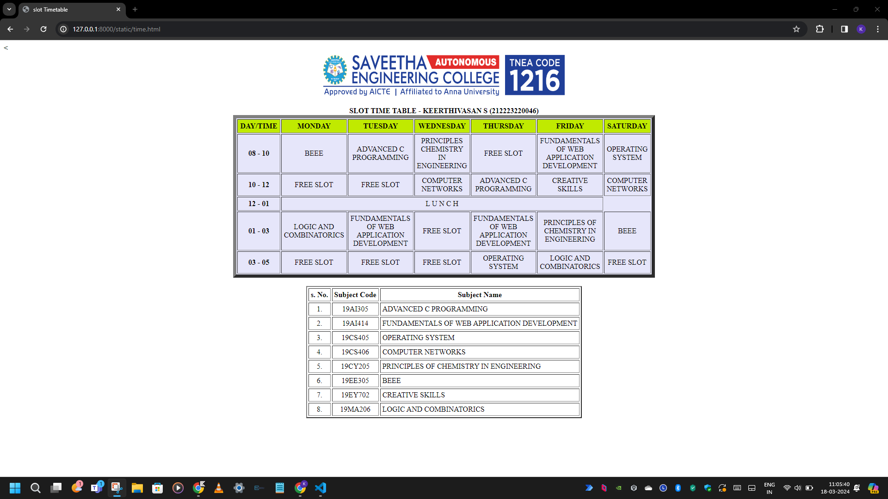

# Ex03 Time Table

## Date :  08/03/2024

## AIM
To write a html webpage page to display your slot timetable.

## ALGORITHM
### STEP 1
Create a Django-admin Interface.

### STEP 2
Create a static folder and inert HTML code.

### STEP 3
Create a simple table using ```<table>``` tag in html.

### STEP 4
Add header row using ```<th>``` tag.

### STEP 5
Add your timetable using ```<td>``` tag.

### STEP 6
Execute the program using runserver command.

## PROGRAM

```
<<html>
    <head>
        <title>slot Timetable</title>
    </head>
    <body>
        <center>
            
        </center>
        <br>
        <table align="center" width="540" cellspacing="2" cellpadding="5" border="7" bgcolor="lavender">
            <caption><b>SLOT TIME TABLE - KEERTHIVASAN S (212223220046)</b></caption>
            <tr align="center">
                <th bgcolor="cream">DAY/TIME</th>
                <th bgcolor="cream">MONDAY</th>
                <th bgcolor="cream">TUESDAY</th>
                <th bgcolor="cream">WEDNESDAY</th>
                <th bgcolor="cream">THURSDAY</th>
                <th bgcolor="cream">FRIDAY</th>
                <th bgcolor="cream">SATURDAY</th>   
            </tr>
            <tr align="center">
                <th bgcolor="lavender">08 - 10</th>
                <td>BEEE</td>
                <td>ADVANCED C PROGRAMMING</td>
                <td>PRINCIPLES CHEMISTRY IN ENGINEERING</td>
                <td>FREE SLOT</td>
                <td>FUNDAMENTALS OF WEB APPLICATION DEVELOPMENT</td>
                <td>OPERATING SYSTEM</td>
            </tr>
            <tr align="center">
                <th bgcolor="lavender">10 - 12</th>
                <td>FREE SLOT</td>
                <td>FREE SLOT</td>
                <td>COMPUTER NETWORKS</td>
                <td>ADVANCED C PROGRAMMING</td>
                <td>CREATIVE SKILLS</td>
                <td>COMPUTER NETWORKS</td>
            </tr>
            <tr>
                <th bgcolor="lavender">12 - 01</th>
                <td colspan="5" align="center">L U N C H</td>
            </tr>
            <tr align="center">
                <th bgcolor="lavender">01 - 03</th>
                <td>LOGIC AND COMBINATORICS</td>
                <td>FUNDAMENTALS OF WEB APPLICATION DEVELOPMENT</td>
                <td>FREE SLOT</td>
                <td>FUNDAMENTALS OF WEB APPLICATION DEVELOPMENT</td>
                <td>PRINCIPLES OF CHEMISTRY IN ENGINEERING</td>
                <td>BEEE</td>
            </tr>
            <tr align="center">
                <th bgcolor="lavender">03 - 05</th>
                <td>FREE SLOT</td>
                <td>FREE SLOT</td>
                <td>FREE SLOT</td>
                <td>OPERATING SYSTEM</td>
                <td>LOGIC AND COMBINATORICS</td>
                <td>FREE SLOT</td>
            </tr>
        </table>
        <br>
        <table align="center" cellspacing="3" cellpadding="4" border="2">
            <tr align="center">
                <th>S. NO</th>
                <th>SUBJECT CODE</th>
                <th>SUBJECT NAME</th>
            </tr>
            <tr>
                <td align="center">1.</td>
                <td align="center">19AI305</td>
                <td>ADVANCED C PROGRAMMING</td>
            </tr>
            <tr>
                <td align="center">2.</td>
                <td align="center">19AI414</td>
                <td>FUNDAMENTALS OF WEB APPLICATION DEVELOPMENT</td>
            </tr>
            <tr>
                <td align="center">3.</td>
                <td align="center">19CS405</td>
                <td>OPERATING SYSTEM</td>
            </tr>
            <tr>
                <td align="center">4.</td>
                <td align="center">19CS406</td>
                <td>COMPUTER NETWORKS</th>
                </tr>
                <tr>
                    <td align="center">5.</td>
                    <td align="center">19CY205</td>
                    <td>PRINCIPLES OF CHEMISTRY IN ENGINEERING</td>
                </tr>
                <tr>
                    <td align="center">6.</td>
                    <td align="center">19EE305</td>
                    <td>BEEE</td>
                </tr>
                <tr>
                    <td align="center">7.</td>
                    <td align="center">19EY702</td>
                    <td>CREATIVE SKILLS</td>
                </tr>
                <tr>
                    <td align="center">8.</td>
                    <td align="center">19MA206</td>
                    <td>LOGIC AND COMBINATORICS</td>
                </tr>
            </table>
        </body>
        </html>
```
## OUTPUT



## RESULT
The program for creating slot timetable using basic HTML tags is executed successfully.
